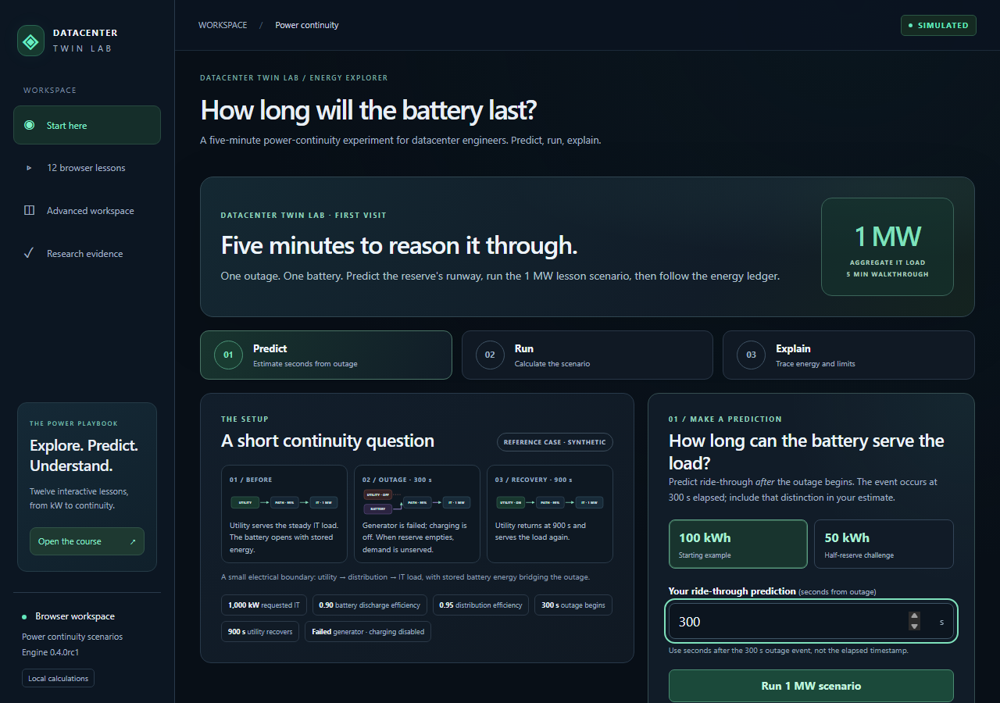
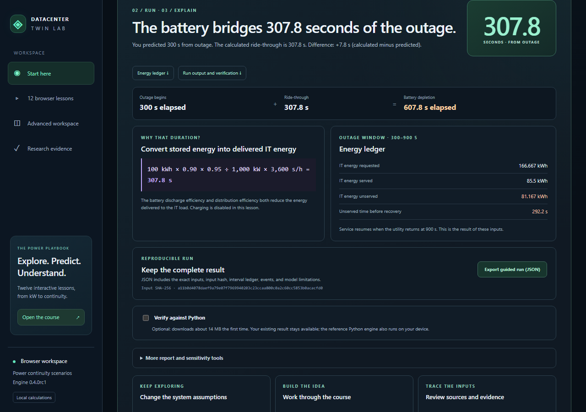

# Datacenter Twin Lab

_A reproducible synthetic continuity laboratory for datacenter power systems._

## Start with one battery question

**How long can a 1 MW IT load ride through a utility outage on 100 kWh of stored battery energy?**

In the five-minute walkthrough, predict the battery's ride-through, deliberately run the scenario, then explain the result from its energy ledger. The example uses `100 kWh × 0.90` battery-discharge efficiency `× 0.95` distribution efficiency = **85.5 kWh delivered to IT**. At **1,000 kW**, that is **307.8 seconds from the outage**, which starts at **300 s elapsed**. Battery depletion is therefore recorded at **607.8 s elapsed**. Charging is disabled and the generator is failed.

[**Open the five-minute guided experiment →**](https://mohammadrezwankhan.github.io/datacenter-twin-lab/) · [Challenge yourself with 50 kWh](https://mohammadrezwankhan.github.io/datacenter-twin-lab/) · [Read the exact inputs and equations](docs/canonical-case.md)

Halving the opening reserve to **50 kWh** gives **42.75 kWh** delivered to IT: **153.9 s from the outage** and depletion at **453.9 s elapsed**. Ride-through is a duration counted from the 300 s outage boundary; depletion is an elapsed event timestamp.

> This is a teaching and research tool for datacenter engineers learning electrical continuity. It is a narrow, synthetic, uncalibrated model—not a production reliability analysis. Detailed model boundaries and validation status are below.

[](https://github.com/mohammadrezwankhan/datacenter-twin-lab/releases) [](https://github.com/mohammadrezwankhan/datacenter-twin-lab/actions/workflows/tests.yml) [](https://ko-fi.com/N7V826XG89)

**v0.4.0rc1 is a release candidate, not a stable release.** No independent external technical review has been obtained. The CI badge follows `main`; check the exact candidate commit's results before relying on them. See [release readiness](docs/engineering/release-readiness.md).

## The three steps

The pictures below are screenshots of the actual guided interface. Their numbered captions name the corresponding action in the walkthrough.

[](docs/images/guide-predict.png)

**01 · Predict.** Choose the 100 kWh starting example or 50 kWh challenge. Enter seconds from the outage at 300 s—not an elapsed timestamp. No result is shown until you choose **Run 1 MW scenario**.

[](docs/images/guide-result.png)

**02 · Run.** The result reports ride-through separately from depletion time, shows the equation, and breaks out requested, served, and unserved IT energy during the outage window.

[](docs/images/guide-evidence.png)

**03 · Explain.** Export the complete JSON run, inspect its inputs and hash, or optionally request a Python comparison. Report and reserve-sensitivity tools are available after the completed result.

[Watch the captioned 60-second tour in the evidence hub →](https://mohammadrezwankhan.github.io/datacenter-twin-lab/?mode=evidence#demo) · [Tour transcript and reproduction notes](docs/examples/proof-demo.md)

## Continue with another part of the lab

- [Open the advanced energy workspace](https://mohammadrezwankhan.github.io/datacenter-twin-lab/?mode=advanced) to inspect the full topology, replay events, change bounded assumptions, and export runs.
- [Open the existing 50 MW outage case](https://mohammadrezwankhan.github.io/datacenter-twin-lab/?preset=ai_cluster_utility_loss). It is a synthetic aggregate electrical case, not a GPU-throughput or grid-adequacy model.
- [Start the 12-lesson course](https://mohammadrezwankhan.github.io/datacenter-twin-lab/?lesson=power-energy), or read its [course notes](docs/tutorials/power-systems-course.md).
- Visit the [evidence hub](https://mohammadrezwankhan.github.io/datacenter-twin-lab/?mode=evidence) for source records and reproducibility material.
- Browse the [tutorials](docs/tutorials/index.md), [scenario catalog](docs/scenarios/index.md), [unit-aware glossary](docs/scenarios/glossary.md), and [contribution ideas](docs/scenarios/contribution-ideas.md).

The current source includes 18 named scenarios, four illustrative facility profiles, the twelve lessons, and on-demand reports and sensitivity tools. Ratings, demand, event timing, rates, and efficiencies are explicit synthetic inputs. [The roadmap](ROADMAP.md) separates capabilities in the release candidate from work still planned or conditional.

## Reproduce the canonical case

The guide follows lesson 3's exact scenario recipe: it starts from the reference-site inputs, then assigns lesson ID/name and source metadata, disables charging, and sets the initial reserve to `100` or `50` kWh. The [canonical case](docs/canonical-case.md) records those inputs and derives the results independently. A direct `generator_failure` preset run happens to produce the same 100 kWh numeric event time because the battery starts full, but its scenario ID, metadata, charging limit, input hash, and run ID are different.

### Reproduce the candidate evidence packet

The tracked [candidate evidence index](data/evidence/index-v0.4.0rc1.json) links the canonical scenario/run JSON, reports, manifest, and receipt. To regenerate and verify the packet from the tagged candidate source:

```sh
git clone https://github.com/mohammadrezwankhan/datacenter-twin-lab.git
cd datacenter-twin-lab
git checkout v0.4.0rc1
python scripts/build_evidence.py --output outputs/evidence
python scripts/build_evidence.py --verify outputs/evidence
```

The script requires a fresh output directory under `outputs/` and prints the manifest digest. For an inspectable checked-in result, use the [tracked evidence index](data/evidence/index-v0.4.0rc1.json) and [receipt](data/evidence/v0.4.0rc1/receipt.md).

### Also run the original CLI preset

If you want the separate base-preset example, these commands run it directly:

```sh
python -m datacenter_twin simulate --preset generator_failure
python -m datacenter_twin simulate --preset generator_failure --format html --output outputs/failure.html
python -m datacenter_twin sweep --preset generator_failure --parameter battery_initial_kwh --values 0 50 100 --format markdown
```

Choose a new output path if it already exists, or explicitly add `--force`. The preset allows charging; at 50 kWh it gives **478.2675 s elapsed**, rather than the guided lesson's **453.9 s elapsed** with charging disabled. The [sensitivity guide](docs/engineering/sensitivity.md) explains the distinction.

The standard-library core can also run from an existing Python 3.12+ checkout. See the [quickstart](docs/quickstart.md) for the source build, loopback dashboard, testing, and the historical released-wheel route. The original v0.3.0a0 wheel preserves its historical files; it does not become the v0.4.0rc1 candidate. Use the current source tree and the candidate's actual published artifacts for candidate verification.

## Checks and evidence

The workflow is configured to test each push to `main` and each pull request. Its matrix targets Python **3.12 and 3.14 on Windows and Linux**; the Playwright Chromium browser journeys run on **Ubuntu with Python 3.12**. These are per-commit checks, not a blanket claim that every commit or this release candidate has passed. Read the [candidate readiness page](docs/engineering/release-readiness.md), [evidence packet instructions](docs/evidence.md), and [benchmark method](docs/engineering/benchmark-method.md) for what is measured and how to reproduce it.

The project uses deterministic quantities, unit-labelled outputs, explicit unknowns, stable input hashes, event logs, and energy ledgers. CI and local reproductions establish software behavior for these synthetic fixtures; they do not establish engineering performance or physical accuracy.

For local verification from the repository root:

```sh
python -m unittest discover -s tests -v
npm --prefix apps/web ci --ignore-scripts
npm --prefix apps/web run build
npm --prefix apps/web run test:engine
python scripts/prepare_browser_demo.py
npm --prefix apps/web run build:demo
npm --prefix apps/web run test:demo
```

Browser and wheel verification details are in the [quickstart](docs/quickstart.md). The [adding-a-scenario guide](docs/engineering/adding-a-scenario.md) describes how to propose a small, independently checkable case. No test, benchmark run, automated audit, or maintainer-produced evidence packet counts as an independent external review.

## Support and project references

Start with [contribution guidance](CONTRIBUTING.md), [beginner contribution ideas](docs/scenarios/contribution-ideas.md), [support](SUPPORT.md), or the [roadmap](ROADMAP.md). Participants follow the [Code of Conduct](CODE_OF_CONDUCT.md). Use [GitHub Discussions](https://github.com/mohammadrezwankhan/datacenter-twin-lab/discussions) to share a reproducible result or review.

If you find this project useful, you can support continued open development on [Ko-fi](https://ko-fi.com/N7V826XG89):

[](https://ko-fi.com/N7V826XG89)

For a task-based comparison with OpenDC and PyPSA, see [Choosing a simulator](docs/choosing-a-simulator.md).

## Assumptions and limits

This is a deterministic, local-first teaching simulator for one aggregate IT load. The current model covers synthetic utility and generator availability, finite stored energy, conversion losses, distribution-path limits, shared-domain events, deterministic recovery, replay, and exact energy accounting. The 50 MW example scales electrical demand and battery energy; it does not predict GPU throughput, grid adequacy, equipment selection, or measured site behavior.

The model does not establish facility calibration, protection coordination, AC transients, cooling behavior, workload queues or throughput, generator ramp/cooldown/fuel dynamics, transfer and switching transients, impedance-based load sharing, harmonics, short-circuit or arc-flash studies, reliability probabilities, Tier or service-level claims, certification, physical controls, or physical safety. No facility measurements or validation dataset were used.

| You can use it to                                                | Model boundary                                                                            |
| ---------------------------------------------------------------- | ----------------------------------------------------------------------------------------- |
| Compare synthetic utility, generator, battery, and path failures | Assumed ratings and efficiencies; no facility calibration                                 |
| Reproduce event times, energy ledgers, and sensitivity reports   | Electrical continuity only; no AC transients, protection, cooling, or workload prediction |
| Learn, inspect, and share a calculation locally                  | No physical controls, certified uptime, or facility safety assessment                     |

The 1 MW reference fixture uses 1,000 kW IT demand, 1,800 s duration, 0.95 distribution efficiency, 100 kWh initial and maximum battery energy, 0.90 discharge efficiency, a 30 s generator start delay, 700 kW path capacities, and a fictional USD 0.10/kWh tariff. The 50 MW case scales demand and battery energy to 50,000 kW and 5,000 kWh while preserving those ratios. These are synthetic inputs, not selected-equipment ratings, live prices, a benchmark, a certification, legal-compliance evidence, or real-site calibration.

Schema-1 PUE and energy planning is separate from schema-2 electrical topology; neither model silently infers the other. Unknown costs and unavailable quantities remain explicit. The dated NVIDIA/model/AWS/Azure/OCI identifiers and one dated Azure East US retail meter are source-backed assumptions, not live feeds, account quotes, capacity allocations, or performance equivalence. Germany, Virginia, and India references are screening pointers, not complete jurisdiction packs or legal advice; India screening must consider the CEA's listed 2026 amendment.

The browser demo has no shared simulation backend or client analytics; its optional Python comparison loads on request. The API binds to loopback. No account, GPU, cloud resource, physical control, shared deployment, database, login, tenant isolation, persistent audit, FAT/SAT, or facility telemetry is introduced. Cooling, workload throughput, calibrated alarms, live telemetry, and predictive models remain planned or unvalidated. A 5,000-star aspiration has no validated timeline and is not evidence of model accuracy or adoption.

Local and CI checks cover the core/API suite, frontend format/type/build, installed-wheel verification, local dashboard journeys, browser/Python journeys, and browser/native equality for synthetic presets. Reference-case timing measures software execution on one local machine; it does not establish scale targets or physical accuracy. These checks are not an independent external review or formal security audit. See [the external review protocol](docs/validation/review-protocol.md) for the requested independent reconstruction.

The public source tree excludes private manuals, planning references, and private repository history. Do not add private manuals, extracted private text, credentials, customer traces, or licensed standards text.

Original code and synthetic fixtures use [Apache-2.0](LICENSE). See [NOTICE](NOTICE), [synthetic provenance](data/provenance/manifest.json), and [browser runtime licenses](docs/third-party/README.md). [SOURCE-MANIFEST.json](SOURCE-MANIFEST.json) identifies the original v0.2.0a0 snapshot, not later versions. [Citation metadata](CITATION.cff) accompanies the project; cite the exact release or commit used.

Alpha release assets remain historical and unchanged. The v0.4.0rc1 candidate is not a stable release, no independent external review has been obtained, and no award or outside endorsement is claimed.
