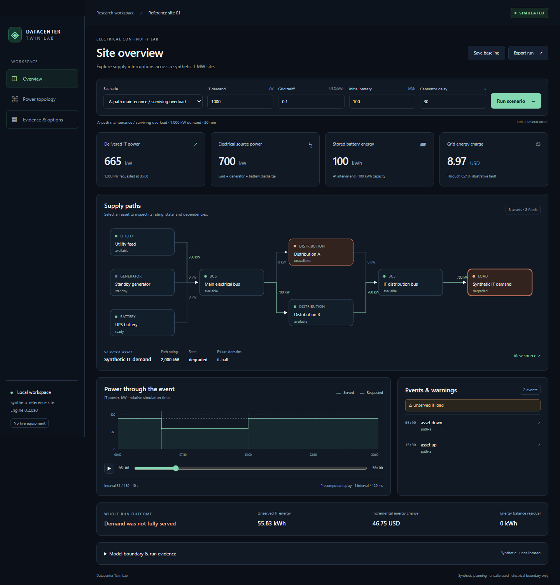

# Datacenter Twin Lab

Synthetic electrical continuity and energy planning with a deterministic Python engine, local API, and dashboard.

Alpha 0.2.0a0 · Python 3.12+ · Local React dashboard

[](https://github.com/mohammadrezwankhan/datacenter-twin-lab/actions/workflows/tests.yml)

For electrical/infrastructure engineers, Python developers, and educators: replay a utility outage, generator startup/failure, finite battery, surviving-path overload, shared failure, and recovery. Every run retains assumptions, units, warnings, and the energy ledger. No real-site calibration, AC transients, cooling simulation, physical controls, or production shared service are included.



## Try the released dashboard

Use the [Python-only quickstart](docs/quickstart.md#run-the-released-dashboard-python-only) to install the [0.2.0a0 release](https://github.com/mohammadrezwankhan/datacenter-twin-lab/releases/tag/v0.2.0a0) in an isolated environment. The wheel includes the built dashboard, so this route needs Python 3.12+ with pip and a browser; Git and Node are not needed. Installation downloads the wheel and API dependencies. The installed examples run locally.

The [worked tutorial](docs/tutorials/continuity-walkthrough.md) explains what to look for: one surviving path serves 665 kW of a 1,000 kW request, and the generator-failure fixture depletes its battery at 607.8 s.

## Run from source

Clone the repository, then run with Python 3.12+:

```sh
git clone https://github.com/mohammadrezwankhan/datacenter-twin-lab.git
cd datacenter-twin-lab
```

```sh
python -m datacenter_twin simulate --preset generator_failure
python -m datacenter_twin simulate --preset path_maintenance
python -m datacenter_twin run data/scenarios/baseline-1mw.json
python -m unittest discover -s tests -v
```

The core requires no installation, network, API key, GPU, or paid service. Optional API tests skip when their dependencies are absent. For the local dashboard, install Node 24 and use:

```sh
python -m pip install -r requirements-api.lock
npm --prefix apps/web ci --ignore-scripts
npm --prefix apps/web run build
python -m datacenter_twin serve
```

Open http://127.0.0.1:8000. Installation needs network access; simulations use the local engine and bundled catalogue.

## Hand-checkable examples

A 700 kW gross surviving path at 0.95 distribution efficiency delivers at most 665 kW to IT. A 1,000 kW request therefore leaves 335 kW unserved during the maintenance interval. A 100 kWh battery at 0.90 discharge and 0.95 distribution efficiency delivers 85.5 kWh to IT: 307.8 seconds at 1,000 kW. These are synthetic assumptions, not equipment validation.

Work through [surviving-path overload and finite battery ride-through](docs/tutorials/continuity-walkthrough.md), with independent equations and reproducible commands.

Read the [quickstart](docs/quickstart.md), [electrical boundary](docs/engineering/electrical-continuity.md), [contracts](docs/contracts/electrical-v2.md), and [security boundary](SECURITY.md). Costs use explicit fictional or dated reference inputs; unknown costs stay unknown. Software tests do not establish facility safety, reliability, compliance, or cloud/GPU performance.

## Provenance and contributions

Original code, documentation, and synthetic fixtures use [Apache-2.0](LICENSE). See [NOTICE](NOTICE), [synthetic provenance](data/provenance/manifest.json), and the dated catalogue packaged in `datacenter_twin/resources/catalog.json`. No private manual, planning brief, prior private Git history, internal campaign records, credentials, or customer traces are included in this export.

[SOURCE-MANIFEST.json](SOURCE-MANIFEST.json) records the original `v0.2.0a0` release snapshot. Its hashes apply to the [tagged source](https://github.com/mohammadrezwankhan/datacenter-twin-lab/tree/v0.2.0a0), not subsequent documentation changes on `main`.

Contribute a reproducible mismatch, an independently derived numerical edge case, or a primary-source correction with its date and uncertainty. Run the tests and describe assumptions and actual validation. Preserve third-party notices. See [contribution guidance](CONTRIBUTING.md) and [citation metadata](CITATION.cff). Cite the exact release or commit you use.
