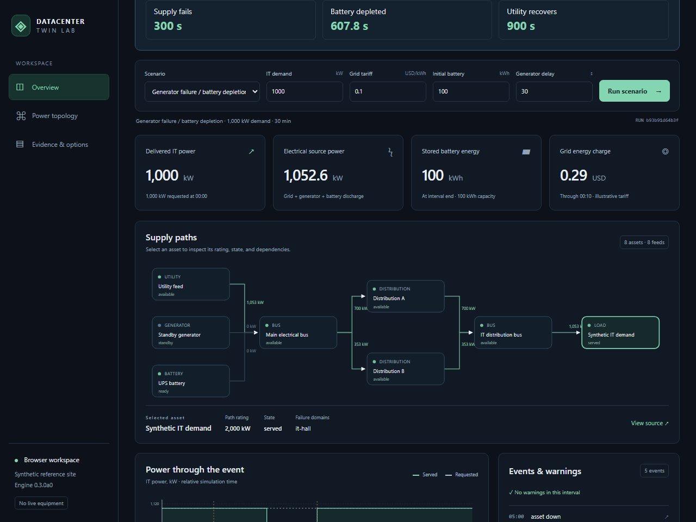

# Datacenter Twin Lab

**Replay a power failure, change the battery reserve, and explain the result.**

A reproducible, local-first power-continuity what-if simulator for engineers, researchers, Python developers, and educators.

[**Open the zero-install demo →**](https://mohammadrezwankhan.github.io/datacenter-twin-lab/) · [Scenario catalog](docs/scenarios/index.md) · [Quickstart](docs/quickstart.md) · [Discuss a result](https://github.com/mohammadrezwankhan/datacenter-twin-lab/discussions)

[](https://mohammadrezwankhan.github.io/datacenter-twin-lab/)

21-second step recording of the actual Python browser demo. [Still image](docs/images/demo-preview.png) · [Transcript and capture recipe](docs/examples/demo-walkthrough.md). Waiting and pointer movement are omitted; this is not a speed benchmark.

Alpha 0.3.0a0 · Python 3.12+ · Apache-2.0

[](https://github.com/mohammadrezwankhan/datacenter-twin-lab/actions/workflows/tests.yml)

## A generator fails. How long does the battery last?

Start with a synthetic 1 MW load and 100 kWh battery. Utility and generator fail at 300 seconds. The battery supplies IT for **307.8 seconds**, depletes at **607.8 seconds elapsed**, and utility restores service at **900 seconds**.

Try a short experiment after the [demo](https://mohammadrezwankhan.github.io/datacenter-twin-lab/) loads:

1. Change **Initial battery** from **100** to **50 kWh**, then select **Run scenario**.
2. Select **Battery depleted 478.3 s**: delivered IT power is **0 kW**.
3. Select **Utility recovers 900 s**: delivered IT power is **1,000 kW**. Export a report or compare reserves below.

The same Python engine runs on your device through WebAssembly. No installation or account is needed; the first load downloads about 14 MB. Pre-outage charging explains why the 50 kWh case lasts until 478.2675 s. [Calculation and privacy](docs/engineering/browser-demo.md) · [Teaching notebook](docs/examples/battery-ride-through.ipynb).

| You can use it to | Model boundary |
| --- | --- |
| Compare synthetic utility, generator, battery, and path failures | Assumed equipment ratings and efficiencies; no facility calibration |
| Reproduce event times, energy ledgers, and sensitivity reports | Electrical continuity only; no AC transients, protection, cooling, or workload prediction |
| Learn, inspect, and share a calculation locally | No physical controls, certified uptime, or facility safety assessment |

## Reproduce the result in Python

The core uses only the standard library. [Run the released CLI or dashboard with one uv command](docs/quickstart.md#run-with-uv), or use Python 3.12+ and a source checkout:

```sh
git clone https://github.com/mohammadrezwankhan/datacenter-twin-lab.git
cd datacenter-twin-lab
python -m datacenter_twin simulate --preset generator_failure
python -m datacenter_twin simulate --preset generator_failure --format html --output outputs/failure.html
python -m datacenter_twin sweep --preset generator_failure --parameter battery_initial_kwh --values 0 50 100 --format markdown
```

Outputs preserve assumptions, units, stable input hashes, warnings, and exact energy ledgers. Unknown costs remain unknown. Existing output files are protected; choose a new path or explicitly use `--force`. The [sensitivity guide](docs/engineering/sensitivity.md) explains the parameters and pre-outage charging. [Example report and reproducibility capsule](docs/validation/reproducibility-capsule.md) include independent equations and artifact hashes.

## Choose a question

| Question | Preset | Expected result |
| --- | --- | --- |
| What happens with healthy supply? | [normal](docs/scenarios/normal.md) | 500 kWh served over 30 minutes |
| Can the battery bridge generator startup? | [utility_loss](docs/scenarios/utility_loss.md) | 30-second startup bridged; no unserved load |
| What if the generator also fails? | [generator_failure](docs/scenarios/generator_failure.md) | Battery depletion at 607.8 s; recovery at 900 s |
| Can one surviving path carry the load? | [path_maintenance](docs/scenarios/path_maintenance.md) | 700 kW gross × 0.95 = 665 kW IT; 335 kW unserved |
| What if both paths share a failed control domain? | [shared_domain](docs/scenarios/shared_domain.md) | Both paths unavailable for 600 s |

The [worked tutorial](docs/tutorials/continuity-walkthrough.md) develops the battery and surviving-path calculations. Schema-1 PUE/energy planning remains a separate calculation from schema-2 continuity; see the [contracts](docs/contracts/electrical-v2.md).

## Use the local dashboard

The [released-wheel quickstart](docs/quickstart.md#run-the-released-dashboard-python-only) installs the dashboard with Python and pip. The [uv route](docs/quickstart.md#run-with-uv) creates its isolated environment automatically. Both include reports and sensitivity controls without Node.

For development, follow the [locked source build](docs/quickstart.md#local-dashboard). Open `http://127.0.0.1:8000` after starting the server. Calculations use the local engine and the API binds to loopback. See the [security boundary](SECURITY.md).

## Validate or contribute

```sh
python -m unittest discover -s tests -v
```

CI checks Python 3.12 and 3.14 on Windows and Linux, the installed wheel, local dashboard journeys, and browser/native equality. These checks establish software behavior for the fixtures. **Independent external technical review has not yet been obtained.** The [review protocol](docs/validation/review-protocol.md) provides a bounded worksheet for checking results and reporting mismatches.

Start with [contribution guidance](CONTRIBUTING.md), [beginner contribution ideas](docs/scenarios/contribution-ideas.md), the [roadmap](ROADMAP.md), or [support](SUPPORT.md). Reproducible questions and hand-calculated edge cases are useful contributions. Participants follow the [Code of Conduct](CODE_OF_CONDUCT.md).

Original code and synthetic fixtures use [Apache-2.0](LICENSE); see [NOTICE](NOTICE), [synthetic provenance](data/provenance/manifest.json), and [browser runtime licenses](docs/third-party/README.md). [SOURCE-MANIFEST.json](SOURCE-MANIFEST.json) identifies the original v0.2.0a0 snapshot, not subsequent versions. [Citation metadata](CITATION.cff) accompanies the project; cite the exact release or commit used.
