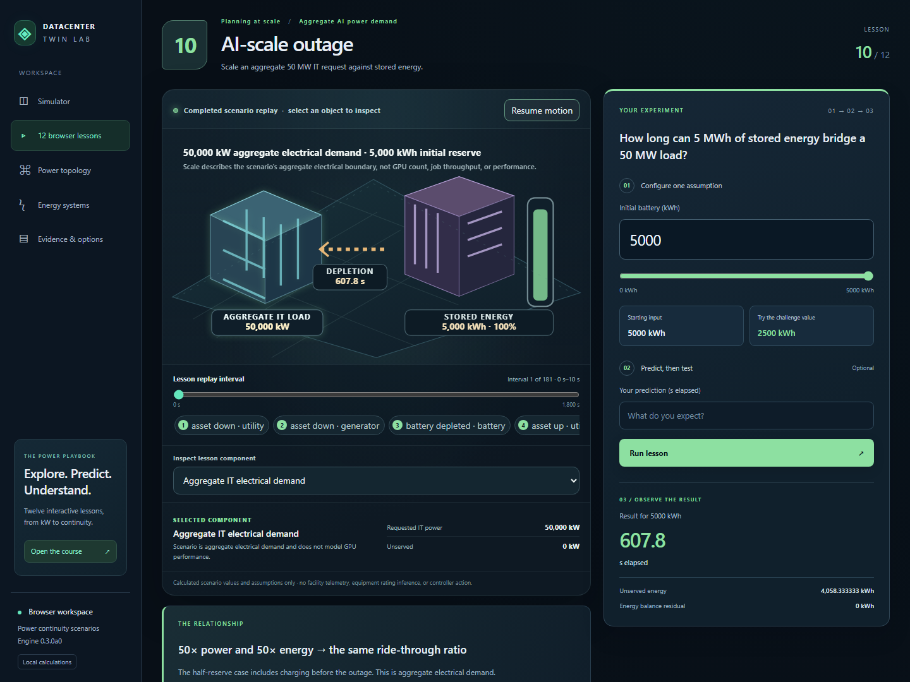

# Explore a power system, one assumption at a time

The [browser course](https://mohammadrezwankhan.github.io/datacenter-twin-lab/?lesson=power-energy) contains twelve interactive lessons for datacenter engineers learning power continuity. No installation or account is needed. Open the atlas for all four chapters, or follow **Next lesson**.

## A first experiment

Open [lesson 3: battery ride-through](https://mohammadrezwankhan.github.io/datacenter-twin-lab/?lesson=ride-through). The starting case has 100 kWh stored, a 1,000 kW IT request, utility loss at 300 seconds, and a failed generator. Charging is disabled. The result is battery depletion at 607.8 seconds elapsed.

Choose **Try the challenge value**, which changes reserve to 50 kWh. Before selecting **Run lesson**, predict the new depletion time in **s elapsed**. The result is **453.9 s**, comprising 300 seconds before failure and 153.9 seconds of battery service. The starting result remains available for comparison. The [worksheet](../tutorials/battery-ride-through-worksheet.md) separates prediction from the worked answer for printing.

Select the battery object to inspect stored energy at the current interval. Select **asset down · utility** to jump to the interval starting at 300 s, then use **Lesson replay interval** to inspect depletion and recovery. Object labels, the interval indicator and the inspector all refer to the completed run; changing an input does not silently recalculate them.

## Four connected chapters

| Chapter | Lessons | What the scenes make visible |
| --- | --- | --- |
| Energy and reserve | 1–3 | Power accumulated over time, distribution losses and a finite battery |
| Continuity systems | 4–6 | Generator startup, generator failure and surviving-path capacity |
| Shared risks and reserve | 7–9 | Shared controls, a common main bus and charging before an outage |
| Planning at scale | 10–12 | A 50 MW aggregate load, a sub-second recovery gap and annual PUE energy |

The [lesson map](../tutorials/power-systems-course.md#lesson-map) gives all inputs, challenge values and hand-checkable expectations. The chapters group related ideas; numbered navigation follows lessons 1 through 12.

## Controls that preserve the calculation

- Use the number field for an exact input or the slider for exploration. Minimum, maximum and step constraints are the same for both. Blank and invalid values cannot replace a completed result.
- Enter an optional prediction in the result's units. The displayed difference is absolute and rounded; the full calculated value remains in the export. Prediction comparison is hidden while the input is an unrun draft.
- Select an illustrated object with a pointer, or focus it using **Tab** and press **Enter** or **Space**. Use arrow keys on input and replay sliders.
- On a phone, use **Inspect lesson component** to choose the same objects through a full-size selector. Read the associated quantities in the component inspector below the scene.
- Select **Pause motion** to stop decorative animation. A reduced-motion device preference disables it automatically. Motion does not advance simulation time or express a control-system response rate.
- **Mark as reviewed** records a self-mark in the current course component's memory. It resets on reload or leaving the course. No completion analytics, account, score or certification is created.
- Navigation resets the new lesson to its starting input, clears its prediction and worked answer, and returns replay to the first interval. The `?lesson=` link opens that lesson directly.

## Read event edge cases correctly

An initially empty battery has no positive-to-zero depletion event. The course therefore says **Battery starts empty** and reports unserved energy separately. A large battery can also have no depletion event; absence of this event alone does not establish uninterrupted service.

In the generator-delay lesson, a 600-second startup delay schedules readiness at the 900-second utility recovery. The generator need not enter a running interval. The UI distinguishes scheduled readiness from recorded generator service.

Path capacity is a gross source-side quantity. It can exceed the IT request; delivered power still cannot exceed requested power. Distribution lesson 2 shows both the required source power in kW and the actual grid energy in kWh over 30 minutes.

PUE lesson 12 uses a separate annual planning calculation. At PUE 1, non-IT energy is zero; changing PUE leaves the stated IT energy unchanged. It has no continuity replay, and its non-IT overhead must not be added to continuity losses again.

## Reproduce and discuss a result

**Export lesson run** includes all inputs, intervals, events, accounting and the input hash. **Download Markdown report** and **Download HTML report** preserve the same completed continuity calculation. Lesson 12 offers **Export PUE calculation**. **Verify against Python** downloads the optional runtime only when requested and compares the complete returned object with the reference engine.

The initial course uses exact JavaScript arithmetic and original inline SVG artwork. The course code is loaded when the course opens, keeping it out of the simulator's first-result path. [Local entry measurements](../validation/course-studio-entry-measurement.json) describe their environment and decoded-byte method; they are not a promise about visitor load times.

The scenes and formulas are original educational material under [Apache-2.0](../../LICENSE). They show synthetic assumptions and completed software results. [Course limits](../tutorials/power-systems-course.md#assumptions-and-limits) continue to apply, including the absence of facility calibration, physical controls, GPU performance prediction or independent external technical review.
