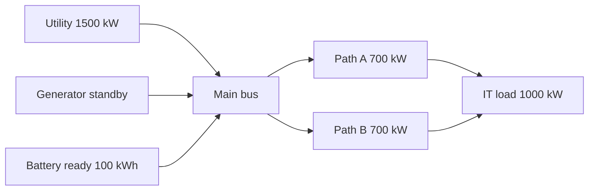

# `normal`

Normal supply is the control case. No events occur; the utility supplies the requested 1,000 kW IT load through two 700 kW gross paths at 0.95 distribution efficiency.



| Time | State | Expected observation |
| --- | --- | --- |
| 0–1,800 s | Utility available; generator standby; battery ready | IT load served throughout; no warnings or events |

Independent check: `1,000 kW × (1,800 s / 3,600 s/h) = 500 kWh` served. At 0.95 distribution efficiency, gross source power is `1,000 / 0.95 = 1,052.631578... kW`, so gross grid energy is `526.315789... kWh`; the difference is distribution loss. The battery remains at 100 kWh.

Run it:

```sh
python -m datacenter_twin simulate --preset normal
```

Expected summary fields include `service_status: "served_throughout"`, `unserved_it_kwh: "0"`, `unserved_duration_s: "0"`, `battery_final_kwh: "100"`, and `energy_balance_residual_kwh: "0"`. The corresponding coverage is [`test_normal_operation_has_independent_energy_expectations`](../../tests/test_continuity.py).

This is a synthetic control case. It does not prove redundancy, uptime, equipment performance, or site behavior.
