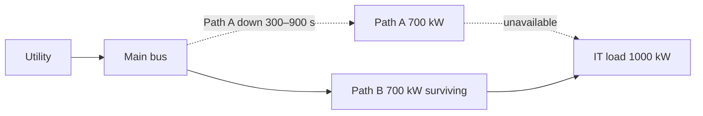

# `path_maintenance`

Path maintenance removes Path A from 300 s through 900 s. Utility supply remains available, but the surviving 700 kW gross Path B cannot deliver the full 1,000 kW IT request after distribution losses.



| Time | Event/state | Expected observation |
| --- | --- | --- |
| 0–300 s | Paths A and B available | IT load served |
| 300–900 s | Path A unavailable; Path B available | 665 kW served, 335 kW unserved; battery remains ready |
| 900–1,800 s | Path A restored | Full service returns |

Independent check: surviving gross capacity is 700 kW. Applying distribution efficiency gives `700 kW × 0.95 = 665 kW` served at the IT boundary. The deficit is `1,000 − 665 = 335 kW`; across 600 s, unserved energy is `335 × 600/3,600 = 55.833333... kWh`. The battery remains at 100 kWh because utility supply remains available and the path bottleneck is downstream. The current run reports `peak_unserved_kw: "335"`, `unserved_duration_s: "600"`, `unserved_it_kwh: "55.833333..."`, and `energy_balance_residual_kwh: "0"`.

Run it:

```sh
python -m datacenter_twin simulate --preset path_maintenance
```

The relevant regression is [`test_surviving_path_overload_limits_delivered_power`](../../tests/test_continuity.py). The path rating and efficiency are synthetic assumptions; the result is not a maintenance or protection recommendation.
