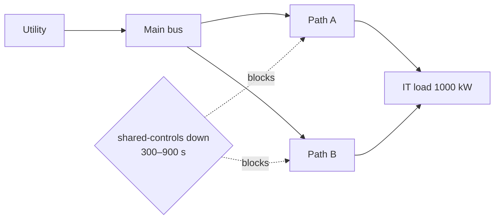

# `shared_domain`

Shared-domain failure removes the `shared-controls` dependency from both distribution paths between 300 s and 900 s. The utility remains available upstream, but neither path can reach the IT load.



| Time | Event/state | Expected observation |
| --- | --- | --- |
| 0–300 s | Shared controls available | Both paths serve the IT load |
| 300–900 s | Shared controls unavailable | Both paths are unavailable; no source reaches IT; 1,000 kW is unserved |
| 900–1,800 s | Shared controls restored | Both paths return and service resumes |

Independent check: the outage interval is 600 s, so unserved energy is `1,000 kW × 600/3,600 h = 166.666666... kWh`. The battery remains at 100 kWh in this fixture because the shared domain blocks the downstream paths; the source cannot serve IT through an unavailable domain. The current run reports `peak_unserved_kw: "1000"`, `unserved_duration_s: "600"`, `unserved_it_kwh: "166.666666..."`, `battery_final_kwh: "100"`, and `energy_balance_residual_kwh: "0"`.

Run it:

```sh
python -m datacenter_twin simulate --preset shared_domain
```

The relevant regression is [`test_shared_domain_takes_down_both_paths`](../../tests/test_continuity.py). This scenario demonstrates modeled dependency correlation only; it is not a common-cause reliability assessment or a facility control recommendation.
