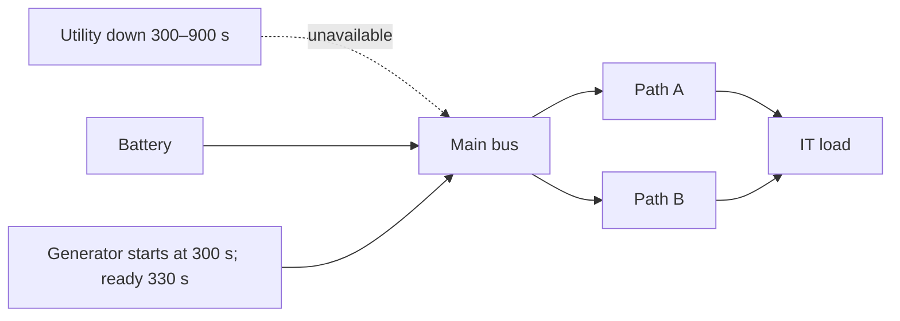

# `utility_loss`

Utility loss tests generator pickup. The utility is unavailable from 300 s through restoration at 900 s. The generator remains available and becomes ready after the declared 30 s start delay.



| Time | Event/state | Expected observation |
| --- | --- | --- |
| 0–300 s | Utility available | Utility serves the IT load; battery stays full |
| 300–330 s | Utility unavailable; generator starting | Battery bridges the generator delay; IT remains served |
| 330–900 s | Generator running | Generator serves the IT load; no unserved interval |
| 900–1,800 s | Utility restored | Utility serves and the battery can return to its 100 kWh opening balance |

Independent check: the bridge is `30 s = 30/3,600 h`; at 1,000 kW IT demand this is `8.333333... kWh` delivered at the IT boundary. The generator-ready boundary is `300 s + 30 s = 330 s`, so the expected unserved duration is 0 s. The verified run reports `served_it_kwh: "500"`, `unserved_it_kwh: "0"`, `unserved_duration_s: "0"`, and `energy_balance_residual_kwh: "0"`; generator energy is `166.666666... kWh` in the current fixture.

Run it:

```sh
python -m datacenter_twin simulate --preset utility_loss
```

The relevant regression is [`test_generator_delay_is_split_inside_regular_timestep`](../../tests/test_continuity.py). The battery/generator behavior is synthetic and does not model fuel, startup physics, transfer switching, or equipment certification.
