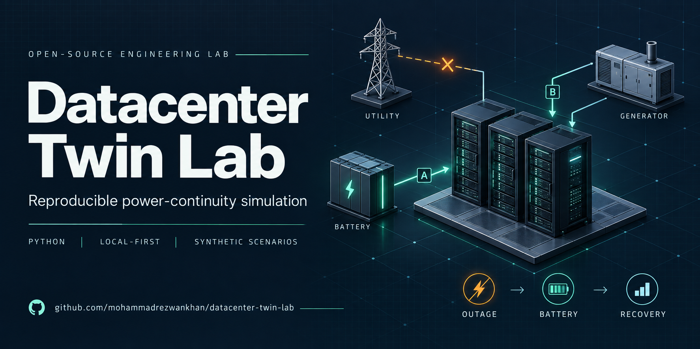
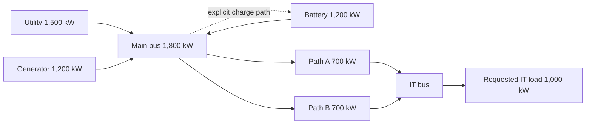

# Surviving-path overload and finite battery ride-through




Maintainer: **Mohammad Rezwan Khan, maintainer of `datacenter-twin-lab`.** This tutorial uses the repository's synthetic electrical example; it is not an engineering approval or a real-site calibration.

## What this teaches

Two outage questions are easy to mix up:

- If one distribution path is unavailable, how much IT power can the surviving path actually deliver?
- If utility and generator supply are unavailable, how long can a finite stored battery serve the requested load?

The current model answers both with explicit topology, losses, event times, and interval records. It does not infer reliability from equipment counts.

## Reproduce the evidence

Run from the repository root with Python 3.12 or later. The core CLI uses the standard library; no account or cloud resource is needed.

```text
python -m datacenter_twin simulate --preset path_maintenance --output outputs/growth-path-maintenance.json
python -m datacenter_twin simulate --preset generator_failure --output outputs/growth-generator-failure.json
python -m unittest discover -s tests -p test_continuity.py -v
```

If an output path already exists, choose a new path or add `--force`. The two output files are local generated evidence and are not part of this content pack. On Windows, `py -3.12` can replace `python` when the launcher is installed.

The preset definitions are in [`datacenter_twin/demo.py`](../../datacenter_twin/demo.py). The complete eight-asset input graph is [`datacenter_twin/resources/reference-site-v2.json`](../../datacenter_twin/resources/reference-site-v2.json). The CLI entry point is [`datacenter_twin/cli.py`](../../datacenter_twin/cli.py).

## The synthetic topology



The input declares 0.95 distribution efficiency, 100 kWh initial and maximum stored battery energy, 0.90 battery discharge efficiency, a 30 s generator start delay, and a 1,800 s run. The tariff in the fixture is a fictional USD 0.10/kWh input; it is not needed for the electrical calculations below and is not a market quote.

The model's contract and boundary are documented in [`docs/contracts/electrical-v2.md`](../contracts/electrical-v2.md) and [`docs/engineering/electrical-continuity.md`](../engineering/electrical-continuity.md).

## Case 1: surviving-path overload

The `path_maintenance` preset takes Path A down at 300 s and restores it at 900 s. During that 600 s interval only Path B remains. The independent calculation is:

```text
surviving gross path = 700 kW
distribution efficiency = 0.95
maximum served IT power = 700 kW × 0.95 = 665 kW
requested IT power = 1,000 kW
unserved IT power = 1,000 kW − 665 kW = 335 kW
unserved energy over 600 s = 335 kW × (600 s / 3,600 s/h)
                         = 55.833333... kWh
```

The exported interval beginning at `300` reports `served_it_kw: "665"`, `unserved_it_kw: "335"`, and the `UNSERVED_IT_LOAD` warning. The summary reports 600 s of unserved duration and 55.833333... kWh of unserved IT energy over the ten-minute maintenance interval. The test independently asserts the 665/335 power values in [`tests/test_continuity.py`](../../tests/test_continuity.py).

The battery stays at 100 kWh in this case. That is a useful result: the battery is available, but discharging it cannot send more power through the surviving 700 kW gross path. The engine only discharges when additional load can be served. A battery symbol on a diagram therefore does not prove that a path overload can be repaired.

## Case 2: finite battery ride-through

The `generator_failure` preset takes both utility and generator assets down at 300 s and restores them at 900 s. The default fixture requests 1,000 kW of IT power. To serve that request through 0.95 distribution efficiency, the source must provide:

```text
required gross source power = 1,000 kW / 0.95
                           = 1,052.631578... kW
```

The battery's 100 kWh is stored energy. Applying the modeled discharge and distribution efficiencies gives the IT-boundary energy:

```text
IT-boundary energy = 100 kWh × 0.90 × 0.95 = 85.5 kWh
ride-through time = 85.5 kWh / 1,000 kW
                  = 0.0855 h × 3,600 s/h
                  = 307.8 s
```

The CLI result therefore records `battery_depleted` at `607.8` s: the outage starts at 300 s, then 307.8 s of finite ride-through elapses. The interval after that boundary reports zero served IT power and `UNSERVED_IT_LOAD` until utility restoration at 900 s. The resulting default-preset figures are:

```text
unserved duration = 900 s − 607.8 s = 292.2 s
unserved IT energy = 1,000 kW × (292.2 s / 3,600 s/h)
                   = 81.166666... kWh
served IT energy over 1,800 s = 500 kWh − 81.166666... kWh
                              = 418.833333... kWh
```

After restoration, the model can charge the battery from spare utility capacity. With the fixture's 100 kW charge limit and 0.95 charge efficiency, the final stored energy is 23.75 kWh after 900 s of restoration (`100 kW × 0.25 h × 0.95`). That is a post-restoration state transition, not evidence that the initial ride-through lasted longer.

The unit test also contains a deliberately separate unity-efficiency fixture. It asserts depletion at 660 s because `100 kWh / 1,000 kW = 0.1 h = 360 s`, added to the 300 s outage start. This isolates finite-energy arithmetic; it should not be substituted for the default fixture's 0.95 and 0.90 efficiencies.

## What the engine proves, and what it does not

The implementation uses exact rational arithmetic, deterministic residual max-flow dispatch, explicit event boundaries, and an energy ledger. The source code is [`datacenter_twin/continuity.py`](../../datacenter_twin/continuity.py); the tests reconstruct the exported energy terms and require a zero energy-balance residual for every preset.

This is an electrical-only, single aggregate-load, synthetic experiment. It excludes cooling, workload queues, battery aging, temperature, generator ramp/cooldown/fuel dynamics, transfer and switching transients, AC load flow, impedance-based load sharing, protection coordination, harmonics, short-circuit and arc-flash studies, physical controls, reliability probabilities, Tier claims, service-level claims, and real-site calibration. The 700 kW paths, 100 kWh battery, efficiencies, event times, and fictional tariff are fixture inputs. They are not selected-equipment ratings, live prices, a benchmark, a certification, or legal compliance evidence.

## Reproduce and contribute

Run both presets, inspect the interval beginning at 300 s, and compare the battery-depleted event with the hand calculation. If a result differs, open a [focused issue](https://github.com/mohammadrezwankhan/datacenter-twin-lab/issues) with the revision, command, input, expected value, and observed value. Contributions should preserve the synthetic assumptions and add an independently derived expectation.

The examples teach inspectable software behavior. They do not establish a facility's reliability or physical validation.
