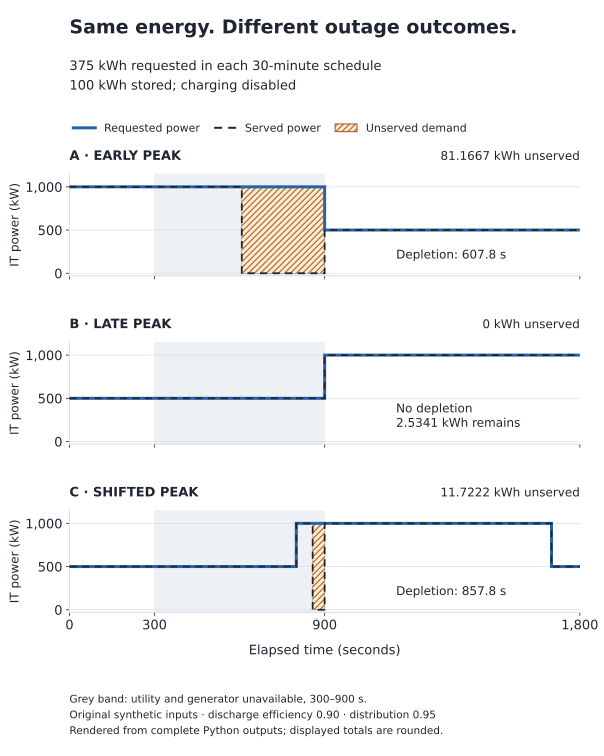

# Same 375 kWh, different outage outcomes

**The time of a demand peak changes what a battery must supply.** Three 30-minute schedules below each request **375 kWh**, average **750 kW**, and reach the same **1,000 kW peak**. They share a 100 kWh battery and the same ten-minute loss of utility and generator supply. One is served throughout; the other two have different amounts of unserved energy.

This is a reproducible exercise for datacenter engineers learning continuity. It extends the [power and energy lesson](https://mohammadrezwankhan.github.io/datacenter-twin-lab/?lesson=power-energy) and [battery ride-through worksheet](battery-ride-through-worksheet.md) by varying **when demand occurs**. All inputs are original synthetic assumptions.

## Compare the schedules

Both utility and generator are unavailable from **300 s up to 900 s**. They recover at 900 s. Charging is disabled throughout the run.

| Case | Prescribed IT demand | Requested energy | Unserved IT energy | Battery depletion, elapsed time |
| --- | --- | ---: | ---: | --- |
| A · Early peak | 1,000 kW for 0–900 s; 500 kW for 900–1,800 s | 375 kWh | 81.1667 kWh | 607.8 s |
| B · Late peak | 500 kW for 0–900 s; 1,000 kW for 900–1,800 s | 375 kWh | 0 kWh | No depletion |
| C · Shifted peak | 500 kW for 0–800 s; 1,000 kW for 800–1,700 s; 500 kW for 1,700–1,800 s | 375 kWh | 11.7222 kWh | 857.8 s |

Every schedule has 900 seconds at each power level. The quantities above are rounded for reading; the downloadable calculations retain full engine precision.



The blue solid line is requested power; the dark dashed line is served power. The grey band locates the common outage. Hatched areas are the power shortfall, whose time integral is unserved energy. All three panels use the same scales. [Figure source](../../scripts/render_demand_timing.py) · [Download the vector figure](../images/demand-timing.svg).

## Reproduce it in the browser

Download a scenario through its **Raw** file view:

- [A: early-peak.json](../examples/demand-timing/early-peak.json)
- [B: late-peak.json](../examples/demand-timing/late-peak.json)
- [C: shifted-peak.json](../examples/demand-timing/shifted-peak.json)

Open the [advanced workspace](https://mohammadrezwankhan.github.io/datacenter-twin-lab/?mode=advanced), select **Import scenario**, choose the saved JSON and select **Run imported scenario**. Files are read on your device. Use **Edit demand timeline** to inspect the schedule, and **Export run** to keep the completed calculation. **Verify against Python** compares the entire result with the reference Python engine on your device.

Use one downloaded case at a time. A draft edit takes effect only after running it. Changing the initial IT demand does not rescale later demand events. The import and timeline controls are in current source and Pages; the unchanged `0.4.0rc2` browser archive predates those controls.

## Reproduce it with Python

Use Python 3.12 or later. The reproduction script needs only the standard library and this source checkout:

```sh
git clone https://github.com/mohammadrezwankhan/datacenter-twin-lab.git
cd datacenter-twin-lab
python scripts/reproduce_demand_timing.py --output outputs/demand-timing
```

The script checks the rational expectations below, then writes complete JSON, Markdown and HTML results for all three cases, `chart-rows.csv`, and a SHA-256 manifest. Choose a new output directory for a rerun; it refuses to replace an existing directory. Record `git rev-parse HEAD` with your results.

The ordinary CLI can run the same downloaded input:

```sh
python -m datacenter_twin simulate --scenario docs/examples/demand-timing/late-peak.json --format html --output outputs/late-peak.html
```

Compare the complete input hashes, rather than filenames or rounded chart labels:

| Case | Canonical input SHA-256 |
| --- | --- |
| A | `31712523bbbcbf6703dccfe3ad67a3ff45b69312dfc10fcc4b8113702b75de19` |
| B | `774ab8c0a66497c4dbe07f8411cd089ee234083a996d1e7f2939113283546abc` |
| C | `db9f178d678eaebdc4fc42c76c85464d9153ba65b70bd88f23fe3616dad5b102` |

Input hashes include names, identifiers and provenance as well as numerical inputs. A manually rebuilt example can have identical arithmetic and a different hash. The output manifest separately records the bytes of each supplied input file. Run identifiers also depend on the engine version.

## Check the result by hand

For every schedule:

```text
requested energy = (1,000 kW × 900 s + 500 kW × 900 s) / 3,600 s/h
                 = 375 kWh
average power    = 375 kWh / 0.5 h = 750 kW

IT-boundary reserve = 100 kWh × 0.90 × 0.95 = 85.5 kWh
```

The reserve is sufficient only if demand **during the outage** fits inside it and the power paths can deliver that demand. Here the declared battery and two distribution paths can carry the 1,000 kW request. Storage energy is the limiting factor in A and C.

**A · Early peak.** The outage overlaps 600 seconds at 1,000 kW. It requests `1,000 × 600 / 3,600 = 500/3 kWh`, about 166.6667 kWh. The 85.5 kWh delivered reserve lasts `85.5 / 1,000 × 3,600 = 307.8 s` after the outage begins. Depletion is at `300 + 307.8 = 607.8 s` elapsed. The remaining `292.2 s` requests `1,000 × 292.2 / 3,600 = 487/6 kWh`, about **81.1667 kWh**, which is unserved.

**B · Late peak.** The same outage overlaps 600 seconds at 500 kW. It requests `500 × 600 / 3,600 = 250/3 kWh`, about **83.3333 kWh**, below the 85.5 kWh delivered reserve. Stored energy remaining at recovery is:

```text
100 − (250/3) / (0.90 × 0.95) = 1,300/513 kWh
                              ≈ 2.534113 kWh
```

The demand rises to 1,000 kW at exactly 900 s, when utility supply recovers. The engine applies both events before calculating the interval starting at 900 s. No positive-duration interval contains high demand without restored utility. This is an event-ordering contract in a discrete model; it establishes no physical transfer performance.

**C · Shifted peak.** Move B's high block 100 seconds earlier while keeping its 900-second length. Demand returns to 500 kW at 1,700 s, preserving 375 kWh total. The outage now overlaps 500 seconds at 500 kW and 100 seconds at 1,000 kW:

```text
outage demand = (500 × 500 + 1,000 × 100) / 3,600
              = 875/9 kWh ≈ 97.2222 kWh
shortfall     = 875/9 − 85.5 = 211/18 kWh ≈ 11.7222 kWh
```

At 800 s, 500 seconds of 500 kW demand have consumed `625/9 kWh` at the IT boundary. The remaining deliverable reserve is `85.5 − 625/9 = 289/18 kWh`. At 1,000 kW it lasts another **57.8 s**, giving depletion at **857.8 s** and **42.2 s** of unserved demand before recovery.

## Try one change and explain it

In B, move the 1,000 kW step earlier and add a return to 500 kW exactly 900 seconds later. Check that the requested-energy preview stays at 375 kWh before running. Explain which part of the high-power block overlaps the outage, and compare its energy with 85.5 kWh. Save the inputs and completed result so someone else can reproduce your reasoning.

Alternatively, increase a battery's **energy** capacity while reducing its **power** rating. Predict whether the reserve calculation alone will still describe service. The [surviving-path walkthrough](continuity-walkthrough.md) explains a separate power-capacity constraint.

## Assumptions, scope and sources

The three supplied files differ only in their identities and demand schedules. Shared assumptions include:

| Quantity or event | Declared value |
| --- | --- |
| Duration / regular output step | 1,800 s / 10 s; event and depletion boundaries split intervals |
| Battery initial / maximum stored energy | 100 / 100 kWh |
| Battery charging limit | 0 kW |
| Battery discharge / distribution efficiency | 0.90 / 0.95 |
| Battery electrical power limit | 1,200 kW before distribution loss |
| Distribution A / B capacity | 700 / 700 kW before distribution loss |
| Utility / generator capacity | 1,500 / 1,200 kW |
| Utility and generator failure / recovery | 300 / 900 s |
| Generator start delay | 30 s; generator supplies no energy in these cases |
| Grid tariff / generator energy price | Unspecified; total monetary cost remains unknown |

These prescribed demand schedules are **not workload scheduling or GPU-performance predictions**. They do not show that real work can move in time, retain throughput, or satisfy a deadline. The exercise does not model transfer transients, AC voltage/frequency behavior, protection, battery aging, thermal response or facility reliability. Energy coverage is a result for the stated deterministic case, not an uptime rating. Independent external technical review has not been obtained.

The original inputs and figure use Apache-2.0; provenance is `EDU-DEMAND-TIMING-001` in the [source manifest](../../data/provenance/manifest.json). The calculation uses the [reference continuity engine at `ccbc288`](https://github.com/mohammadrezwankhan/datacenter-twin-lab/blob/ccbc288a4983d185320d17bf9813c91e881b0b20/datacenter_twin/continuity.py) and its [electrical contract](../engineering/electrical-continuity.md). No private planning text, customer trace or vendor performance claim is used.

To redraw the figure, use the optional Matplotlib authoring dependency (tested with 3.11.2):

```sh
python scripts/render_demand_timing.py --results outputs/demand-timing --output outputs/demand-timing/figure.svg
```

The graph is built from the verified output rows; no smoothing is applied. Matplotlib is unnecessary for the simulation, reports or browser exercise. A concrete mismatch can be reported through the [existing issue form](https://github.com/mohammadrezwankhan/datacenter-twin-lab/issues/new/choose) with the saved scenario, engine version and observed result.
